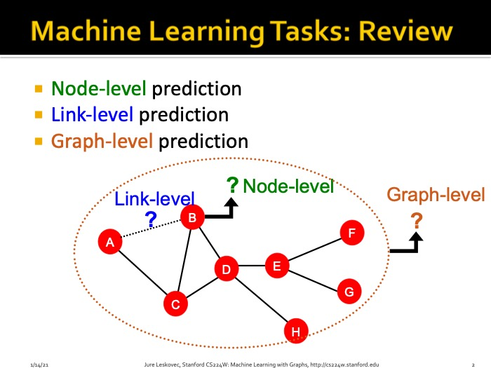

Traditional Methods for Machine Learning in Graphs
==================================================
This chapter covers typical tasks and useful features in Graphs at different levels.
- [Node level](02_traditional_ml/node_level_tasks_and_features.html): node-level tasks ususally focus on node classifications. Useful features include ode degrees, node centrality, clustering coefficients.
- [Edge level](02_traditional_ml/link_prediction_tasks_and_features.html): edge-level tasks focus on edge prediction, including predicting missing edges and predicting new emergences of edges. Useful edges include distances and neighborhood overlap between nodes.
- [Graph level](02_traditional_ml/graph_level_features_and_graph_kernels.html): graph-level tasks focus on classification and charactierzation of graphs. One can construct different kernels to characterize graphs.

